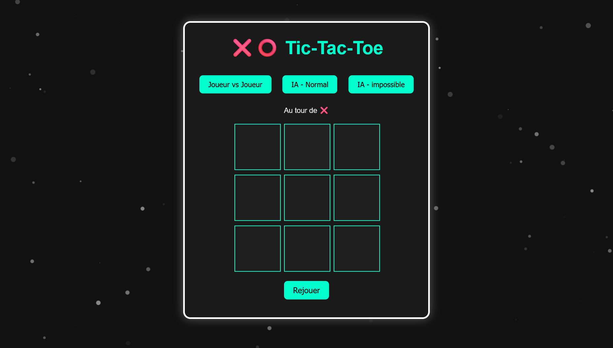

# 🧠 Tic Tac Toe AI

Un jeu de morpion (Tic Tac Toe) codé en JavaScript, HTML et CSS avec deux modes contre une IA : **facile (aléatoire)** et **difficile (minimax)**.  
Jouez aussi en local à deux sur le même appareil !

---

## 🎮 Fonctionnalités

- ✅ Mode Joueur vs Joueur (local)
- 🤖 Mode IA facile (choix aléatoire)
- 🧠 Mode IA difficile (algorithme Minimax)
- 🔊 Effets sonores : clic, victoire, égalité
- 🕹️ Choix du premier joueur (toi ou l'IA)
- 🎨 Interface responsive simple et claire
- ❌ Mise en évidence des cases gagnantes

---

## 🧰 Technologies

- HTML / CSS
- JavaScript
- Aucune bibliothèque externe (sans dépendance)

---

## 📁 Structure du projet

```
📦 Tic-Tac-Toe
├── index.html
├── style.css
├── script.js
├── sounds/
│   ├── click.wav
│   ├── win.wav
│   └── draw.wav
└── README.md
```

---

## 🚀 Lancer le jeu

1. Clone ou télécharge le repo :
   ```bash
   git clone https://github.com/Vili-Dev/tic-tac-toe.git
   ```

2. Ouvre `index.html` dans ton navigateur (Live Server recommandé pour un meilleur confort).

---

## 🔉 Astuce : Ajouter ou désactiver les sons

Tu peux désactiver les sons en mettant en commentaire ces lignes dans `script.js` :

```js
soundClick.play();
soundWin.play();
soundDraw.play();
```

---

## 💡 Idées d'amélioration

- Ajouter un bouton "Mute"
- Sauvegarder les scores
- Mode multijoueur en ligne

---

## 📸 Aperçu



---

## 🧑‍💻 Auteur

Projet réalisé par [Vili](https://github.com/Vili-Dev)

---

## 📄 Licence

Ce projet est open-source sous licence MIT.
